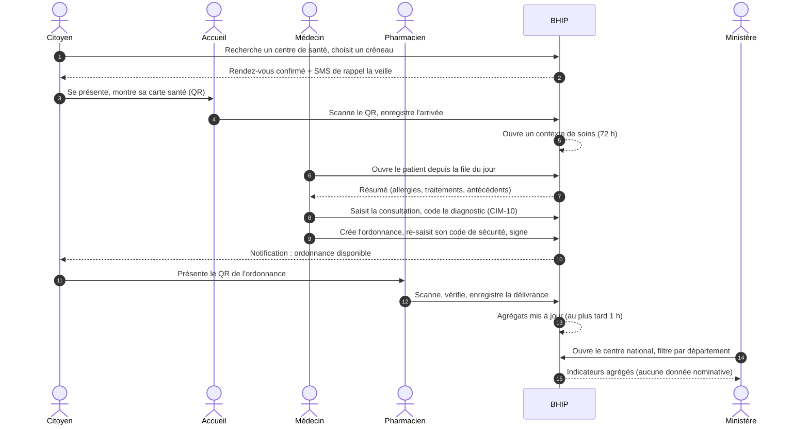

# 6. Parcours de bout en bout

Un parcours enchaîne plusieurs fonctionnalités, dans l'ordre où elles sont vécues. Il sert à vérifier que les fiches s'emboîtent et constitue la base des tests de bout en bout (chapitre 26). Les parcours sont présentés dans **l'ordre où ils deviennent possibles** : on ne peut pas prendre rendez-vous avant qu'un établissement et ses agendas existent.

## 6.1 Parcours PA — Mise en service d'un établissement (préalable à tout)

| # | Acteur | Action | Fiche |
|---|---|---|---|
| 1 | Administrateur plateforme | Crée l'établissement dans le référentiel (type, niveau, département, commune, zone sanitaire, coordonnées GPS) | F-ADM-02 |
| 2 | Administrateur plateforme | Invite le responsable d'établissement (affiliation `FACILITY_ADMIN`) | F-ADM-02 |
| 3 | Responsable | Active son compte, configure la double authentification | F-AUTH-05, F-AUTH-06 |
| 4 | Responsable | Complète la fiche : services, horaires, équipements, capacité | F-ETA-03 |
| 5 | Responsable | Invite son personnel : médecins, infirmiers, accueil | F-ETA-04 |
| 6 | Chaque professionnel | Active son compte, saisit son numéro d'inscription à l'Ordre | F-AUTH-05 |
| 7 | Administrateur plateforme | Valide les profils professionnels | F-ADM-03 |
| 8 | Responsable | Crée les agendas (services, praticiens, créneaux) | F-ETA-05 |
| 9 | — | L'établissement apparaît dans la recherche publique et accepte des rendez-vous | F-ETA-01 |

## 6.2 Parcours PB — Première utilisation par un citoyen

| # | Citoyen | Système | Fiche |
|---|---|---|---|
| 1 | Ouvre l'application, touche « Créer mon espace santé » | Affiche le formulaire court : nom, prénoms, date de naissance, sexe, téléphone, email facultatif, mot de passe | F-AUTH-01 |
| 2 | Valide | Envoie un code SMS à 6 chiffres | F-AUTH-01 |
| 3 | Saisit le code | Vérifie ; recherche un dossier existant correspondant (doublon) ; crée le compte (N1) et le dossier patient avec son **identifiant santé** | F-AUTH-01 |
| 4 | Suit l'assistant | Groupe sanguin (ou « je ne sais pas »), allergies, antécédents, contact d'urgence — chaque étape peut être passée | F-CIT-01 |
| 5 | Termine | Affiche le tableau de bord et la carte santé (QR) | F-CIT-02, F-CIT-05 |

## 6.3 Parcours PC — Du rendez-vous à l'ordonnance (scénario principal de démonstration)

| # | Acteur | Action détaillée | Fiche |
|---|---|---|---|
| 1 | Citoyen | Cherche « centre de santé » près de lui, filtre par service « médecine générale », ouvre la fiche | F-ETA-01, F-ETA-02 |
| 2 | Citoyen | Choisit un créneau, indique le motif (liste simple), confirme | F-RDV-01 |
| 3 | Système | Confirme immédiatement (ou met « en attente » si l'établissement valide manuellement) ; programme les rappels | F-RDV-01, F-RDV-07 |
| 4 | Accueil | Le jour J, dans la file du jour, sélectionne le patient ; scanne son QR ; le patient accepte ou non le partage de l'historique complet | F-RDV-04 |
| 5 | Infirmier (facultatif) | Prend les constantes (température, tension, poids) | F-CLI-12 |
| 6 | Médecin | Ouvre le patient « arrivé » ; lit le résumé ; démarre la consultation | F-CLI-04, F-CLI-05 |
| 7 | Médecin | Saisit motif, symptômes, examen, diagnostic codé ; le brouillon est enregistré automatiquement | F-CLI-06 |
| 8 | Médecin | Crée l'ordonnance ; le système contrôle les allergies ; le médecin signe | F-PRE-01 à F-PRE-04 |
| 9 | Médecin | Valide la consultation (la consultation et l'ordonnance deviennent non modifiables) | F-CLI-07 |
| 10 | Accueil | Le passage est clôturé | F-RDV-05 |
| 11 | Citoyen | Reçoit la notification ; voit la consultation (résumé) et l'ordonnance dans son dossier | F-CIT-03, F-CIT-06 |
| 12 | Pharmacien | Scanne le QR de l'ordonnance ; vérifie ; délivre (éventuellement partiellement) | F-PHA-02, F-PHA-03 |
| 13 | Ministère | Voit l'augmentation du nombre de consultations et le diagnostic dans le top des pathologies de la zone | F-PIL-02 |

## 6.4 Parcours PD — Examen de laboratoire

| # | Acteur | Action | Fiche |
|---|---|---|---|
| 1 | Médecin | Pendant la consultation, demande « Goutte épaisse » et « NFS », choisit le laboratoire (ou « au choix du patient ») | F-LAB-01 |
| 2 | Patient | Reçoit un code de demande (et le voit dans son dossier) ; se rend au laboratoire | F-LAB-01 |
| 3 | Technicien | Retrouve la demande (code ou QR), enregistre le prélèvement | F-LAB-02 |
| 4 | Technicien | Saisit les résultats (valeurs, unités, normes) et joint le compte rendu PDF si besoin | F-LAB-03 |
| 5 | Responsable du labo | Contrôle et valide | F-LAB-04 |
| 6 | Système | Notifie le médecin ; notifie le patient **sauf** si le résultat est marqué « à annoncer par un professionnel » | F-LAB-05 |

## 6.5 Parcours PE — Agent communautaire hors ligne

| # | Acteur | Action | Fiche |
|---|---|---|---|
| 1 | Agent | Au centre de santé (avec réseau) : se connecte, définit son code PIN, télécharge les données de son aire | F-COM-01 |
| 2 | Agent | Au village (sans réseau) : ouvre l'application avec son PIN ; enregistre une nouvelle personne | F-COM-02 |
| 3 | Agent | Réalise une visite : questions guidées ; l'application détecte un signe de danger et propose une **référence** vers le centre de santé | F-COM-03 |
| 4 | Agent | Enregistre une vaccination de campagne | F-COM-04 |
| 5 | Agent | De retour en zone couverte : touche « Synchroniser » ; le système envoie les saisies, signale les éventuels doublons, confirme | F-COM-08 |

## 6.6 Parcours PF — Urgence (patient inconscient)

| # | Acteur | Action | Fiche |
|---|---|---|---|
| 1 | Médecin | Recherche le patient par téléphone + date de naissance (trouvé via un proche) : aucune base d'accès → « Aucun patient accessible ne correspond. » | F-CLI-02 |
| 2 | Médecin | Ouvre « Accès d'urgence », saisit le patient, choisit le motif, écrit une justification (20 caractères minimum), confirme avec son code de sécurité | F-CLI-10 |
| 3 | Système | Ouvre l'accès pour 4 h ; affiche un bandeau rouge « Accès d'urgence » ; informe le patient par notification et SMS ; informe l'auditeur et le responsable d'établissement | F-CLI-10 |
| 4 | Auditeur | Revoit l'accès sous 7 jours : conforme ou non conforme | F-AUD-02 |

## 6.7 Parcours PG — Pilotage ministère

| # | Acteur | Action | Fiche |
|---|---|---|---|
| 1 | Analyste du ministère | Se connecte (double authentification obligatoire) | F-AUTH-02, F-AUTH-06 |
| 2 | Analyste | Ouvre le centre national : indicateurs clés sur la période choisie | F-PIL-02 |
| 3 | Analyste | Clique sur un département sur la carte : les indicateurs se filtrent | F-PIL-03 |
| 4 | Analyste | Compare l'évolution des cas de paludisme sur 12 semaines entre deux zones sanitaires | F-PIL-04 |
| 5 | Analyste | Exporte un rapport PDF ; saisit le motif de l'export (tracé) | F-PIL-05 |
