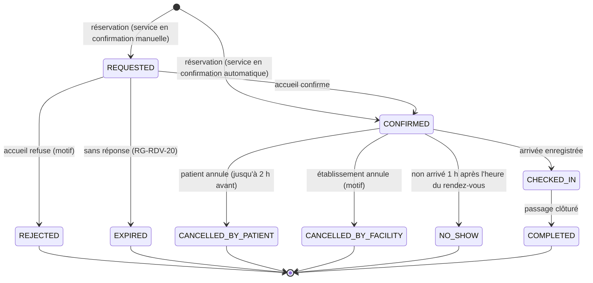

# 9. Fiches fonctionnelles — Établissements, agendas et rendez-vous

## 9.1 Cycle de vie d'un rendez-vous

- **RG-RDV-00** — Seules les transitions de la figure 9.1 sont autorisées. Elles DOIVENT être codées dans **une seule fonction** `transitionAppointment(id, to, actor, reason?)` qui refuse toute autre transition avec l'erreur `APPT_INVALID_TRANSITION`.

### F-ETA-01 — Rechercher un établissement

| Élément | Valeur |
|---|---|
| Rôles | Tous, y compris visiteur non connecté |
| Priorité / étape | P0 / E13 |
| Écrans | `/etablissements` (onglets « Liste » et « Carte ») |
| API | `GET /api/v1/facilities?q=&type=&service=&commune=&near=lat,lng&openNow=&cursor=` |

**Déroulé pas à pas.**

1. L'écran s'ouvre sur l'onglet « Liste ». Si l'utilisateur accepte la géolocalisation, les résultats sont triés par distance ; sinon, il choisit son **département** puis sa **commune** (listes).
2. Il peut filtrer par : type d'établissement, service (médecine générale, pédiatrie, maternité, vaccination, laboratoire, pharmacie…), « ouvert maintenant », « accepte les rendez-vous en ligne ».
3. Chaque résultat affiche : nom, type, commune et quartier, distance (si géolocalisé), statut « Ouvert / Fermé » calculé selon les horaires, badge « Rendez-vous en ligne », téléphone.
4. L'onglet « Carte » affiche les mêmes résultats sur une carte (OpenStreetMap), avec regroupement des points proches.

**Règles strictes.**

- **RG-ETA-01** — Seuls les établissements au statut `ACTIVE` apparaissent.
- **RG-ETA-02** — La recherche textuelle DOIT ignorer les accents et la casse (« cotonou » trouve « Cotonou », « akpakpa » trouve « Akpakpa »).
- **RG-ETA-03** — Résultats paginés par 20 ; la carte charge au maximum 500 points pour la zone visible.
- **RG-ETA-04** — La position de l'utilisateur NE DOIT PAS être enregistrée côté serveur.

**Critères d'acceptation.** CA-1 : filtrer « Maternité » à Porto-Novo ne renvoie que des établissements ayant ce service dans cette commune. CA-2 : sans géolocalisation, la liste reste utilisable.

### F-ETA-02 — Fiche publique d'un établissement

| Élément | Valeur |
|---|---|
| Rôles | Tous |
| Priorité / étape | P0 / E13 |
| Écrans | `/etablissements/[id]` |

**Contenu.** Nom, type, niveau dans la pyramide sanitaire, adresse, commune, département, zone sanitaire, téléphone, horaires par jour, services proposés (avec pour chacun « Rendez-vous en ligne : oui/non »), équipements notables (P1), carte de localisation, bouton « Itinéraire » (ouvre l'application de cartes du téléphone), bouton « Prendre rendez-vous » par service.

**Règle stricte.** **RG-ETA-10** — La fiche NE DOIT PAS afficher la liste nominative du personnel, sauf les praticiens qui ont accepté d'être affichés (paramètre de profil, désactivé par défaut).

### F-ETA-03 — Gérer la fiche de son établissement

| Élément | Valeur |
|---|---|
| Rôles | `FACILITY_ADMIN` |
| Priorité / étape | P0 / E09 |
| Écrans | `/etablissement/fiche`, `/etablissement/services` |
| API | `PATCH /api/v1/facility`, `POST/PATCH /api/v1/facility/services` |

**Ce que le responsable peut modifier.** Téléphone, email, horaires d'ouverture par jour (plusieurs plages possibles, ex. 8 h–12 h 30 et 15 h–18 h), services (activer/désactiver dans la liste de référence, confirmation automatique ou manuelle des rendez-vous), équipements et capacité (nombre de lits), description courte, fermetures exceptionnelles (dates et motif).

**Ce qu'il NE PEUT PAS modifier** (réservé à l'administrateur plateforme, F-ADM-02) : nom officiel, type, niveau, rattachement géographique, coordonnées GPS, statut.

**Règles strictes.** **RG-ETA-20** — Désactiver un service qui a des rendez-vous futurs DOIT afficher leur **nombre** et proposer : « Annuler ces rendez-vous et prévenir les patients » (traitement automatique, notifications `N-APPT-CANCELLED-FAC`, sans afficher de noms au responsable) ou « Abandonner ». **RG-ETA-21** — Toute modification est versionnée et journalisée.

### F-ETA-04 — Gérer le personnel

| Élément | Valeur |
|---|---|
| Rôles | `FACILITY_ADMIN` |
| Priorité / étape | P0 / E09 |
| Écrans | `/etablissement/personnel`, `/etablissement/personnel/inviter` |
| API | `GET/POST /api/v1/facility/staff`, `POST /api/v1/facility/staff/{membershipId}/suspend`, `/end` |

**Déroulé — inviter.** Le responsable saisit nom, prénoms, téléphone ou email, rôle (liste limitée selon le type d'établissement, section 18.5), services concernés, date de début. Le système envoie l'invitation (F-AUTH-05).

**Liste du personnel.** Colonnes : nom, rôle, services, statut (invité, en validation, actif, suspendu, terminé), date de début, dernière connexion. Filtres par rôle et statut.

**Actions.** Renvoyer l'invitation, suspendre (motif obligatoire, effet immédiat RG-ROL-08), terminer l'affiliation (départ), réactiver une affiliation suspendue.

**Règles strictes.** **RG-ETA-30** — Un responsable NE PEUT PAS suspendre ou terminer sa propre affiliation `FACILITY_ADMIN` s'il est le seul responsable actif. **RG-ETA-31** — Terminer l'affiliation d'un médecin qui a des rendez-vous futurs DOIT obliger à les réaffecter ou les annuler.

**Critère d'acceptation.** CA-1 : un infirmier suspendu est déconnecté de l'espace de cet établissement à sa requête suivante, mais conserve son espace citoyen.

### F-ETA-05 — Définir les agendas

| Élément | Valeur |
|---|---|
| Rôles | `FACILITY_ADMIN` ; `RECEPTIONIST` peut ajouter des fermetures ponctuelles |
| Priorité / étape | P0 / E09 |
| Écrans | `/etablissement/agendas` |
| API | `GET/POST/PATCH /api/v1/facility/schedules`, `POST /api/v1/facility/closures` |

**Principe.** Un **modèle d'agenda** décrit, pour un service (et éventuellement un praticien) : les jours de la semaine, l'heure de début et de fin, la **durée d'un créneau** (10, 15, 20, 30, 45 ou 60 minutes) et la **capacité** d'un créneau (nombre de patients, de 1 à 10 — utile pour les consultations « par ordre d'arrivée » dans une plage). Le système **génère les créneaux** 60 jours à l'avance.

**Déroulé pas à pas.**

1. Le responsable choisit le service, puis (facultatif) le praticien.
2. Il coche les jours, saisit les heures, la durée et la capacité.
3. Le système affiche un **aperçu** de la semaine type avec le nombre de créneaux générés.
4. Il enregistre ; une tâche planifiée génère les créneaux des 60 prochains jours, puis chaque nuit ajoute le jour suivant.
5. Pour une **fermeture** (jour férié, congé, grève), il saisit la date ou la période et le motif : les créneaux concernés sont bloqués ; le responsable voit le **nombre** de rendez-vous touchés ; leur annulation nominative et l'information des patients sont faites par l'accueil (action « Annuler et prévenir » dans son espace), car le responsable n'a pas d'accès nominatif (RG-ACC-41).

**Règles strictes.**

- **RG-ETA-40** — Deux modèles d'agenda d'un même praticien NE DOIVENT PAS se chevaucher.
- **RG-ETA-41** — Modifier un modèle NE DOIT PAS supprimer les créneaux déjà réservés ; seuls les créneaux libres futurs sont regénérés.
- **RG-ETA-42** — Les jours fériés nationaux sont chargés depuis un référentiel (paramètre annuel) et ne génèrent pas de créneaux sauf pour les services marqués « urgences / permanence ».
- **RG-ETA-43** — Toutes les heures sont saisies et affichées dans le fuseau **Africa/Porto-Novo** (UTC+1, sans heure d'été) et stockées en UTC.

**Critère d'acceptation.** CA-1 : un modèle « lundi à vendredi, 8 h–12 h, 15 min, capacité 1 » génère 16 créneaux par jour ouvré, aucun le samedi.

### F-RDV-01 — Prendre un rendez-vous (citoyen)

| Élément | Valeur |
|---|---|
| Rôles | `CITIZEN` (pour soi ou une personne à charge) |
| Priorité / étape | P0 / E13 |
| Écrans | `/citoyen/rendez-vous/nouveau?etablissement=&service=` |
| API | `GET /api/v1/facilities/{id}/slots?service=&from=&to=`, `POST /api/v1/appointments` |

**Déroulé pas à pas.**

| # | Citoyen | Système |
|---|---|---|
| 1 | Choisit la personne (moi / personne à charge) | — |
| 2 | Choisit l'établissement et le service (ou arrive depuis la fiche de l'établissement) | Affiche les 7 prochains jours ayant des créneaux libres, jour par jour, en commençant par le premier jour disponible. |
| 3 | Choisit un jour, puis un créneau (boutons « 08:30 », « 08:45 »…) | Seuls les créneaux libres et réservables sont affichés. |
| 4 | Choisit un motif simple (liste : consultation, suivi, vaccination, consultation prénatale, autre) et peut ajouter une précision (140 caractères) | Rappelle : « Ne mettez pas d'informations médicales détaillées ici. » |
| 5 | Confirme | Dans une transaction : vérifie les règles, réserve la place du créneau, crée le rendez-vous (`CONFIRMED` ou `REQUESTED` selon le service), programme les rappels. |
| 6 | — | Écran de confirmation : date, heure, lieu, bouton « Ajouter à mon agenda » (fichier .ics), rappel « Présentez votre carte santé à l'accueil ». Notification + SMS de confirmation. |

**Cas particuliers et erreurs.**

| Situation | Comportement attendu |
|---|---|
| Le créneau vient d'être pris par quelqu'un d'autre | « Ce créneau vient d'être réservé. Choisissez-en un autre. » et rafraîchissement de la liste (`APPT_SLOT_FULL`). |
| Le patient a déjà 3 rendez-vous à venir | « Vous avez déjà 3 rendez-vous prévus. Annulez-en un pour en prendre un nouveau. » (`APPT_LIMIT_REACHED`) |
| Le patient a déjà un rendez-vous le même jour dans ce même établissement | « Vous avez déjà un rendez-vous ce jour-là dans cet établissement. » |
| Le patient est en restriction pour absences répétées | Le rendez-vous est créé au statut `REQUESTED` (confirmation manuelle), avec le message « Votre demande sera confirmée par l'établissement. » |

**Règles strictes.**

- **RG-RDV-01** — Un créneau est réservable à partir de **1 heure** après l'instant présent et jusqu'à **30 jours** à l'avance (paramètre par établissement, maximum 90).
- **RG-RDV-02** — Un patient PEUT avoir au maximum **3 rendez-vous futurs** actifs (`REQUESTED` + `CONFIRMED`), toutes personnes à charge comptées séparément.
- **RG-RDV-03** — La réservation d'une place DOIT être **atomique** : `UPDATE slots SET booked = booked + 1 WHERE id = ? AND booked < capacity` ; si aucune ligne n'est modifiée, le créneau est complet. Aucune double réservation n'est possible, même avec 50 demandes simultanées.
- **RG-RDV-04** — Le motif détaillé NE DOIT PAS être envoyé dans les SMS.
- **RG-RDV-05** — Un patient ayant **3 absences** (`NO_SHOW`) sur 90 jours voit ses nouvelles réservations passer en confirmation manuelle pendant 30 jours.

**Critères d'acceptation.** CA-1 : 20 réservations simultanées sur un créneau de capacité 1 produisent exactement 1 rendez-vous (test automatisé de concurrence). CA-2 : un rendez-vous confirmé apparaît immédiatement dans la file de l'accueil du jour concerné.

### F-RDV-02 — Annuler ou déplacer un rendez-vous (citoyen)

| Élément | Valeur |
|---|---|
| Rôles | `CITIZEN` |
| Priorité / étape | P0 / E13 |
| API | `POST /api/v1/appointments/{id}/cancel`, `POST /api/v1/appointments/{id}/reschedule` |

**Déroulé.** Depuis « Mes rendez-vous », « Annuler » → motif facultatif → confirmation → la place est libérée, les rappels sont supprimés, l'établissement voit l'annulation. « Déplacer » ouvre le choix de créneau (F-RDV-01 étape 3) ; le nouveau rendez-vous est créé **avant** l'annulation de l'ancien, dans la même transaction (si le nouveau échoue, l'ancien est conservé).

**Règles strictes.** **RG-RDV-10** — L'annulation par le patient est possible jusqu'à **2 heures** avant l'heure du rendez-vous ; ensuite, le bouton est remplacé par « Appeler l'établissement » (numéro affiché). **RG-RDV-11** — Un rendez-vous ne peut être déplacé que **2 fois** ; ensuite, il faut annuler et reprendre.

### F-RDV-03 — Confirmer ou refuser les demandes (accueil)

| Élément | Valeur |
|---|---|
| Rôles | `RECEPTIONIST` |
| Priorité / étape | P0 / E14 |
| Écrans | `/pro/accueil/demandes` |
| API | `POST /api/v1/appointments/{id}/confirm`, `/reject` |

**Déroulé.** Liste des rendez-vous `REQUESTED` triés par date de rendez-vous. Pour chacun : patient (nom, âge), service, date, motif simple, nombre d'absences récentes. Actions : « Confirmer » ou « Refuser » (motif obligatoire, envoyé au patient : « créneau indisponible », « service fermé », « orientez-vous vers un autre établissement », autre). **RG-RDV-20** — Une demande passe à `EXPIRED` (et le patient est prévenu) si elle n'a pas reçu de réponse **24 heures après la demande**, ou au plus tard **1 heure avant le créneau**, au premier des deux.

### F-RDV-04 — File du jour et enregistrement de l'arrivée

| Élément | Valeur |
|---|---|
| Rôles | `RECEPTIONIST` (principal), `NURSE`, `DOCTOR` (lecture de la file) |
| Priorité / étape | P0 / E14 |
| Écrans | `/pro/accueil` |
| API | `GET /api/v1/facility/queue?date=`, `POST /api/v1/visits` (arrivée), `POST /api/v1/visits/walk-in` |

**Objectif.** Organiser la journée et ouvrir le **contexte de soins** (base B4) qui autorise les soignants à accéder au dossier.

**Écran.** Colonnes (ou onglets sur mobile) : **Attendus** (rendez-vous du jour non arrivés, par heure), **Arrivés / en attente**, **En consultation**, **Terminés**, **Absents**. Compteurs en haut. Bouton principal « Enregistrer une arrivée ». Rafraîchissement automatique toutes les 30 secondes.

**Déroulé — patient avec rendez-vous.**

| # | Accueil | Système |
|---|---|---|
| 1 | Sélectionne le patient dans « Attendus » **ou** scanne sa carte santé | Si le QR est scanné : identifie le patient et **prouve la présence** (moyen 1, RG-ACC-20). |
| 2 | Si pas de QR : touche « Envoyer un code au patient » | Envoie un code SMS de 6 chiffres au téléphone du dossier ; l'accueil saisit le code dicté par le patient (moyen 2). |
| 3 | Si le patient n'a pas de téléphone : coche « Présence vérifiée sur pièce » et choisit le type de pièce | Moyen 3, tracé et comptabilisé (RG-ACC-21). |
| 4 | Pose la question au patient : « Acceptez-vous que les soignants de l'établissement voient tout votre dossier pendant votre visite ? » et coche Oui / Non | Enregistre le choix (`FULL` ou `SUMMARY`) avec le moyen de vérification comme preuve. |
| 5 | Choisit le service et, si besoin, le praticien | Crée la **visite** (statut `ARRIVED`), ouvre le **contexte de soins** (72 h), passe le rendez-vous à `CHECKED_IN`, place le patient dans « Arrivés », avec son heure d'arrivée. |
| 6 | — | Le patient apparaît dans le tableau de bord des soignants du service. |

**Déroulé — patient sans rendez-vous (cas le plus fréquent).** Bouton « Arrivée sans rendez-vous » : recherche exacte du patient (RG-ACC-40) → s'il n'existe pas, création du dossier (F-CLI-03) → étapes 1 à 5 identiques, sans rendez-vous lié.

**Règles strictes.**

- **RG-RDV-30** — Un contexte de soins NE DOIT être ouvert que par l'enregistrement d'une arrivée avec l'un des trois moyens de vérification.
- **RG-RDV-31** — Une même personne NE DOIT PAS avoir deux visites ouvertes dans le même établissement.
- **RG-RDV-32** — L'accueil NE VOIT JAMAIS les données cliniques, même après l'arrivée.
- **RG-RDV-33** — L'arrivée est possible de **2 heures avant** à **1 heure après** l'heure du rendez-vous ; au-delà, elle est enregistrée comme « sans rendez-vous » et le rendez-vous est marqué `NO_SHOW` automatiquement si non honoré.

**Critères d'acceptation.** CA-1 : avant l'arrivée, le médecin reçoit 404 sur le dossier ; après l'arrivée, il voit le résumé. CA-2 : un QR déjà utilisé est refusé. CA-3 : l'agent d'accueil ne peut obtenir aucune donnée clinique par l'API (tests sur toutes les routes cliniques).

### F-RDV-05 — Absences et clôture des passages

| Élément | Valeur |
|---|---|
| Rôles | `RECEPTIONIST`, soignants ; tâche planifiée |
| Priorité / étape | P0 / E14 |

**Déroulé.** Un soignant qui démarre une consultation passe la visite à `IN_CARE` ; la validation de la consultation propose « Terminer la visite » → `COMPLETED` (et rendez-vous `COMPLETED`). L'accueil peut marquer « Parti sans être vu » (`LEFT_WITHOUT_CARE`). **RG-RDV-40** — Une tâche planifiée **horaire** DOIT passer à `NO_SHOW` les rendez-vous `CONFIRMED` dont l'heure est dépassée de plus d'**1 heure** sans arrivée (RG-RDV-33). Une tâche quotidienne à **23 h 00** sert de filet de sécurité pour les rendez-vous du jour oubliés et à `COMPLETED` les visites restées ouvertes plus de 24 h, en le journalisant. **RG-RDV-41** — Le contexte de soins se ferme 24 h après la clôture de la visite (et au plus tard 72 h après l'ouverture).

### F-RDV-06 — Rendez-vous pris au guichet ou par téléphone

| Élément | Valeur |
|---|---|
| Rôles | `RECEPTIONIST` |
| Priorité / étape | P1 / E14 |
| Écrans | `/pro/accueil/rdv/nouveau` |

**Déroulé.** L'accueil retrouve le patient (recherche exacte) ou crée son dossier, puis choisit service et créneau comme en F-RDV-01. Le rendez-vous est `CONFIRMED` directement. Le patient reçoit le SMS de confirmation. Les règles RG-RDV-01 à RG-RDV-03 s'appliquent, sauf RG-RDV-01 (l'accueil peut réserver dès maintenant).

### F-RDV-07 — Rappels automatiques

| Élément | Valeur |
|---|---|
| Rôles | Système |
| Priorité / étape | P0 / E23 |

**Règles strictes.**

- **RG-RDV-50** — Rappel **la veille à 18 h 00** (heure locale) et **2 heures avant** si le rendez-vous a été pris plus de 3 heures à l'avance.
- **RG-RDV-51** — Texte du SMS (modèle fixe, 160 caractères maximum, sans donnée médicale) : « BHIP : rappel de votre rendez-vous le 14/10 à 09:30, CS Akpakpa. Pour annuler : bhip.bj/r/K7M4 ». Le lien court ouvre l'application (connexion exigée).
- **RG-RDV-52** — Un rendez-vous annulé DOIT annuler ses rappels non envoyés.
- **RG-RDV-53** — Les rappels respectent les préférences de l'utilisateur (F-NOT-03), sauf le rappel de la veille qui est toujours envoyé par notification interne.
