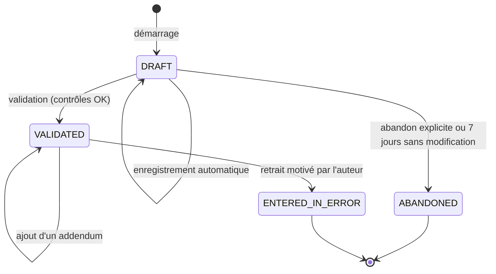

# 10. Fiches fonctionnelles — Consultation et dossier clinique

Ce module est le cœur métier. L'espace professionnel utilise la couleur **bleue** (section 19.2), une densité d'information moyenne et un **bandeau patient** toujours visible en haut de l'écran dès qu'un patient est ouvert : nom, prénoms, âge, sexe, identifiant santé, niveau de vérification, **allergies en rouge**, base d'accès en cours (ex. « Contexte de soins — expire le 15/10 à 9 h »).

## 10.1 Cycle de vie d'une consultation

- **RG-CLI-00** — Une consultation `VALIDATED` est **immuable** : aucun champ ne peut être modifié, par personne. Les corrections passent par un **addendum** (F-CLI-08). La suppression n'existe pas.

### F-CLI-01 — Tableau de bord professionnel

| Élément | Valeur |
|---|---|
| Rôles | `DOCTOR`, `NURSE` |
| Priorité / étape | P0 / E15 |
| Écrans | `/pro` |
| API | `GET /api/v1/pro/dashboard` |

**Composition (ordre imposé).**

1. **Patients du jour** : patients arrivés dans les services du professionnel, avec heure d'arrivée, temps d'attente (en minutes, orange au-delà de 60), statut (en attente, constantes prises, en consultation), bouton « Ouvrir ».
2. **Mes rendez-vous du jour** : ceux qui lui sont affectés nommément.
3. **À traiter** : brouillons de consultation non validés (avec l'âge du brouillon), résultats d'examens reçus non lus, demandes de consentement acceptées, ordonnances à renouveler (P1), **références communautaires** `OPEN` adressées à l'établissement (P1, F-COM-03 : actions « Vue » et « Clôturer », avec ouverture du dossier seulement si une base d'accès existe).
4. **Recherche rapide** : champ unique (identifiant santé, code de partage, téléphone + date de naissance) et bouton « Scanner un QR ».

**Règle stricte.** **RG-CLI-01** — Le tableau de bord NE DOIT afficher que des patients ayant une base d'accès valide pour ce professionnel dans l'espace actif.

**Critère d'acceptation.** CA-1 : un patient arrivé dans le service « pédiatrie » n'apparaît pas chez un médecin affecté uniquement à « médecine générale », sauf si ce médecin l'ouvre via la recherche (il reste accessible, car le contexte de soins couvre l'établissement).

### F-CLI-02 — Rechercher un patient

| Élément | Valeur |
|---|---|
| Rôles | `DOCTOR`, `NURSE`, `RECEPTIONIST` (recherche exacte seulement) |
| Priorité / étape | P0 / E15 |
| Écrans | `/pro/patients` |
| API | `GET /api/v1/patients/search?healthId=&phone=&birthDate=&name=` |

**Modes de recherche, du plus sûr au moins sûr.**

1. **Scan du QR** de la carte santé ou saisie d'un **code de partage** (F-CIT-11).
2. **Identifiant santé** exact.
3. **Téléphone + date de naissance** (correspondance exacte).
4. **Nom + prénom + date de naissance** (correspondance approchée) — **uniquement** parmi les patients pour lesquels le professionnel a déjà une base d'accès (ses patients).

**Règles strictes.**

- **RG-CLI-10** — Une recherche NE DOIT JAMAIS renvoyer un patient sans base d'accès : elle renvoie « Aucun patient accessible ne correspond. » Le professionnel voit alors trois actions : « Demander l'accès au patient » (envoie une demande de consentement si un compte existe — le système ne dit pas si le compte existe : « Si ce patient a un compte, il recevra votre demande »), « Enregistrer l'arrivée » (renvoie vers l'accueil) et « Accès d'urgence » (F-CLI-10).
- **RG-CLI-11** — Chaque recherche est journalisée avec ses critères (téléphone et date de naissance hachés dans le journal).
- **RG-CLI-12** — Plus de **30 recherches sans résultat en 1 heure** par un même professionnel déclenchent une alerte d'anomalie (F-AUD-03).

**Critère d'acceptation.** CA-1 : rechercher par téléphone et date de naissance un patient existant mais sans base d'accès renvoie exactement la même réponse qu'un patient inexistant.

### F-CLI-03 — Créer un dossier patient (sans compte) avec contrôle des doublons

| Élément | Valeur |
|---|---|
| Rôles | `DOCTOR`, `NURSE`, `RECEPTIONIST`, `CHW` (F-COM-02) |
| Priorité / étape | P0 / E14 |
| Écrans | `/pro/patients/nouveau` |
| API | `POST /api/v1/patients/duplicates-check`, `POST /api/v1/patients` |

**Déroulé pas à pas.**

| # | Professionnel | Système |
|---|---|---|
| 1 | Saisit : nom, prénoms, sexe, date de naissance (ou âge estimé : « environ 35 ans », coché « date approximative »), téléphone (facultatif), commune et quartier/village de résidence, nom d'un contact | — |
| 2 | Touche « Vérifier les doublons » (obligatoire avant « Créer ») | Calcule un **score de similarité** avec les dossiers existants (section 18.3). |
| 3a | Aucun candidat (score < 60) | Bouton « Créer le dossier » actif. |
| 3b | Candidats trouvés (score ≥ 60) | Affiche jusqu'à 5 candidats avec **uniquement** : initiales du nom, prénoms, année de naissance, sexe, commune, 4 derniers chiffres du téléphone. Actions : « C'est cette personne » (→ enregistrement d'arrivée, vérification exigée) ou « Aucun ne correspond » (justification obligatoire, 10 caractères minimum). |
| 4 | Confirme | Crée le dossier (niveau N0 si rien n'est vérifié ; N2 si l'agent coche « pièce d'identité vue » avec le type de pièce), génère l'identifiant santé, envoie au patient un SMS avec le **code de réclamation** (F-AUTH-03) s'il a un téléphone. |
| 5 | — | Propose d'imprimer une **carte santé papier** (identifiant santé en clair + QR contenant l'identifiant). |

**Règles strictes.**

- **RG-CLI-20** — La création DOIT être impossible sans passage par la vérification des doublons (contrôle côté serveur : le `POST /patients` exige un jeton de vérification valable 10 minutes, renvoyé par `duplicates-check`).
- **RG-CLI-21** — Les créations forcées (« aucun ne correspond » malgré un score ≥ 80) DOIVENT alimenter la file de revue des doublons de l'administrateur (F-ADM-06).
- **RG-CLI-22** — Date approximative : stockée au 1er juillet de l'année estimée avec l'indicateur `birthDateApproximate = true`, affiché « ≈ 35 ans ».

**Critère d'acceptation.** CA-1 : tenter de créer « KOSSOU Jean, 12/03/1985, 0197123456 » alors que « Kossou Jean, 12/03/1985 » existe affiche le candidat.

### F-CLI-04 — Consulter le résumé patient

| Élément | Valeur |
|---|---|
| Rôles | `DOCTOR`, `NURSE` |
| Priorité / étape | P0 / E15 |
| Écrans | `/pro/patients/[id]` |
| API | `GET /api/v1/patients/{id}/summary` |

**Contenu (ordre imposé).**

1. **Bandeau patient** (voir introduction du chapitre).
2. **Alertes cliniques** : allergies (avec réaction et source : déclarée / confirmée), grossesse en cours si connue, maladies chroniques.
3. **Traitements en cours** (ordonnances actives).
4. **Derniers événements** : 5 dernières consultations (date, établissement, diagnostic principal), derniers résultats anormaux, dernières constantes (avec date).
5. **Vaccinations** (carnet).
6. Boutons d'action : « Démarrer une consultation » (si contexte de soins ou rendez-vous du jour), « Voir tout l'historique » (si niveau `FULL`), « Résumé IA » (P1, F-IA-01).

**Règles strictes.**

- **RG-CLI-30** — Les éléments non couverts par la base d'accès NE DOIVENT PAS être envoyés au navigateur (filtrage côté serveur) ; une ligne neutre « Certaines informations ne sont pas partagées avec vous » est affichée si des éléments ont été retirés, sans en indiquer la nature ni le nombre.
- **RG-CLI-31** — L'ouverture du résumé est journalisée `VIEW` / `SUMMARY` avec la base d'accès.
- **RG-CLI-32** — Chaque information affiche sa **source** (déclarée par le patient / saisie par [professionnel, établissement, date]).

**Critères d'acceptation.** CA-1 : avec une base `SUMMARY`, la réponse de l'API ne contient aucune consultation. CA-2 : une allergie apparaît dans le bandeau en rouge sur toutes les pages du patient.

### F-CLI-05 — Démarrer une consultation

| Élément | Valeur |
|---|---|
| Rôles | `DOCTOR` ; `NURSE` pour une note de soins (F-CLI-12) |
| Priorité / étape | P0 / E16 |
| Écrans | `/pro/patients/[id]/consultations/nouvelle` → `/pro/patients/[id]/consultations/[cid]` |
| API | `POST /api/v1/patients/{id}/consultations` |

**Préconditions.** Le professionnel a une base d'accès **avec droit d'écriture** (RG-ACC-15) : (a) contexte de soins (B4) dans l'établissement actif ; **ou** (b) consentement (B3) actif **et** rendez-vous `CONFIRMED` ou `CHECKED_IN` du jour avec ce médecin ; **ou** (c) accès d'urgence (B5) en cours.

**Déroulé.**

1. Le médecin touche « Démarrer une consultation ».
2. Le système vérifie qu'il n'existe pas déjà un brouillon de ce médecin pour ce patient : si oui, il le rouvre (« Vous avez un brouillon commencé à 9 h 12 ») au lieu d'en créer un second.
3. Il crée la consultation `DRAFT`, liée au patient, au médecin, à l'établissement, à la visite en cours et au rendez-vous éventuel ; passe la visite à `IN_CARE`.
4. Il affiche l'écran de consultation en **trois zones** : à gauche (ou en haut sur mobile) le **résumé patient** replié ; au centre la **saisie** ; à droite (ou en bas) les **actions** : « Prescrire », « Demander un examen », « Planifier un suivi », « Valider la consultation ».

**Règles strictes.**

- **RG-CLI-40** — Un médecin ne PEUT avoir qu'**un seul brouillon ouvert** par patient.
- **RG-CLI-41** — Le brouillon est **visible uniquement par son auteur** ; il n'apparaît ni au patient, ni aux autres soignants, ni dans les statistiques.
- **RG-CLI-42** — Enregistrement automatique **toutes les 10 secondes** après une modification, et à chaque sortie de champ ; indicateur « Enregistré à 9 h 14 » / « Enregistrement… » / « Hors connexion — enregistré sur cet appareil ». En cas de coupure réseau, le brouillon est conservé localement (chiffré) et renvoyé au retour du réseau.
- **RG-CLI-43** — Un brouillon non modifié depuis **7 jours** passe à `ABANDONED` (tâche planifiée), après un rappel au médecin à J+3.

### F-CLI-06 — Saisie clinique (motif, constantes, examen, diagnostic)

| Élément | Valeur |
|---|---|
| Rôles | `DOCTOR` |
| Priorité / étape | P0 / E16 |
| API | `PATCH /api/v1/consultations/{id}` (brouillon uniquement) |

**Sections de saisie (ordre imposé à l'écran).**

| Section | Contenu | Obligatoire pour valider | Visible par le patient |
|---|---|---|---|
| 1. Motif | Liste de motifs fréquents + texte court (200 caractères) | **Oui** | Oui |
| 2. Histoire de la maladie | Texte libre (4 000 caractères) | Non | Oui |
| 3. Symptômes | Étiquettes à choisir (fièvre, toux, céphalées, diarrhée, vomissements, douleurs abdominales…) + libre | Non | Oui |
| 4. Constantes | Voir tableau des contrôles ci-dessous ; pré-remplies si l'infirmier les a prises (F-CLI-12) | Non | Oui |
| 5. Examen clinique | Texte libre | Non | Oui |
| 6. Observations réservées | Texte libre, pour les soignants uniquement | Non | **Non** |
| 7. Diagnostics | Diagnostic **principal** codé CIM-10 (recherche par code ou libellé) + certitude (`CONFIRMED` / `SUSPECTED`) ; diagnostics secondaires (0 à 5) | **Oui** (principal) | Oui, libellé simplifié |
| 8. Conclusion et conseils | Texte libre destiné au patient, avec modèles de phrases | **Oui** | Oui |
| 9. Suites | Ordonnance, examens demandés, rendez-vous de suivi (date conseillée), déclaration ou fin de **grossesse en cours** (date des dernières règles, table `pregnancies`), référence (P2) | Non | Oui |

**Contrôles des constantes.**

| Constante | Unité | Plage acceptée (sinon refus) | Plage d'alerte (confirmation demandée) |
|---|---|---|---|
| Température | °C | 30,0 – 45,0 | < 35,5 ou ≥ 38,5 |
| Pouls | battements/min | 20 – 250 | < 50 ou > 120 (adulte) |
| Tension systolique / diastolique | mmHg | 50–300 / 20–200, systolique > diastolique | ≥ 140/90 ou < 90/60 |
| Fréquence respiratoire | /min | 5 – 80 | > 24 (adulte) |
| Saturation en oxygène | % | 50 – 100 | < 94 |
| Poids | kg | 0,3 – 300 | Variation > 10 % depuis la dernière mesure de moins de 30 jours |
| Taille | cm | 20 – 250 | — |
| Glycémie capillaire | g/L | 0,2 – 6,0 | < 0,7 ou > 1,8 |
| IMC | calculé | — | < 18,5 ou ≥ 30 |

**Règles strictes.**

- **RG-CLI-50** — Une valeur hors plage acceptée DOIT être refusée avec le message « Valeur impossible, vérifiez la saisie » ; une valeur dans la plage d'alerte DOIT être acceptée mais affichée en orange avec la confirmation « Valeur inhabituelle, confirmez-vous ? ».
- **RG-CLI-51** — Les plages d'alerte pédiatriques DOIVENT dépendre de l'âge (table de référence fournie en section 18.7).
- **RG-CLI-52** — Le diagnostic principal DOIT être un code CIM-10 du référentiel. S'il n'est pas encore établi, le médecin choisit un code de symptôme (chapitre R de la CIM-10, ex. `R50.9 Fièvre, sans précision`) avec la certitude `SUSPECTED`.
- **RG-CLI-53** — Un diagnostic dont le code est dans la liste des **codes sensibles** (section 18.6) marque automatiquement la consultation comme `SENSITIVE` ; le médecin voit l'information « Cette consultation sera protégée (confidentialité renforcée) ».
- **RG-CLI-54** — Le champ « Observations réservées » NE DOIT JAMAIS être renvoyé par les API de l'espace citoyen.

### F-CLI-07 — Valider (signer) une consultation

| Élément | Valeur |
|---|---|
| Rôles | `DOCTOR` auteur du brouillon |
| Priorité / étape | P0 / E16 |
| API | `POST /api/v1/consultations/{id}/validate` |

**Déroulé.**

1. Le médecin touche « Valider la consultation ».
2. Le système vérifie les champs obligatoires ; en cas de manque, il liste les sections à compléter et place le curseur sur la première.
3. Il vérifie que les ordonnances liées sont **signées** ou **abandonnées** (pas de brouillon d'ordonnance orphelin).
4. Il affiche un **récapitulatif** en lecture seule : « Après validation, cette consultation ne pourra plus être modifiée. »
5. Le médecin confirme. Le système : passe la consultation à `VALIDATED`, enregistre l'horodatage de validation et l'**empreinte SHA-256** du contenu canonique, met à jour les statistiques (via événement pour les agrégats), notifie le patient (« Le compte rendu de votre consultation du 14/10 est disponible »), propose « Terminer la visite ».

**Règles strictes.** **RG-CLI-60** — Seul l'auteur PEUT valider son brouillon. **RG-CLI-61** — La date de consultation affichée est la date de **démarrage** ; la date de validation est conservée séparément. **RG-CLI-62** — Une consultation validée plus de **48 heures** après son démarrage est marquée « validation tardive » (indicateur qualité, visible par le responsable d'établissement en agrégé).

**Critères d'acceptation.** CA-1 : sans diagnostic principal, la validation est refusée avec la liste des champs manquants. CA-2 : après validation, `PATCH /consultations/{id}` renvoie 409 `CLI_LOCKED`. CA-3 : le patient voit la consultation, sans les observations réservées.

### F-CLI-08 — Addendum et retrait d'une consultation saisie par erreur

| Élément | Valeur |
|---|---|
| Rôles | Auteur de la consultation |
| Priorité / étape | P1 / E16 |
| API | `POST /api/v1/consultations/{id}/addenda`, `POST /api/v1/consultations/{id}/entered-in-error` |

**Addendum.** Texte libre (2 000 caractères) + motif (liste : « complément d'information », « correction », « résultat reçu », autre). L'addendum est affiché sous la consultation, daté et signé. Il PEUT corriger le diagnostic principal : le nouveau code est alors enregistré comme « diagnostic corrigé » et c'est lui qui est utilisé dans les statistiques à partir de la correction.

**Retrait (« saisi par erreur »).** Réservé au cas où la consultation a été saisie sur le mauvais patient. Motif obligatoire, ré-authentification (RG-AUTH-53). La consultation reste visible barrée pour le patient et les soignants (RG-CIT-22) et est exclue des statistiques. Le responsable d'établissement est notifié.

**Règle stricte.** **RG-CLI-70** — Addendum et retrait sont possibles **pendant 12 mois** après la validation ; ensuite, seul un addendum de l'auteur ou du responsable médical désigné est possible.

### F-CLI-09 — Consulter l'historique complet

| Élément | Valeur |
|---|---|
| Rôles | `DOCTOR`, `NURSE` (sans sensible) |
| Priorité / étape | P0 / E15 |
| Écrans | `/pro/patients/[id]/historique` |
| API | `GET /api/v1/patients/{id}/timeline?type=&from=&to=&facility=&cursor=` |

**Contenu.** Chronologie de tous les événements couverts par la base d'accès (consultations, ordonnances et délivrances, examens et résultats, vaccinations, documents, visites communautaires), filtres par type, période et établissement, 25 éléments par page. Chaque élément s'ouvre en détail dans un panneau latéral sans quitter la chronologie.

**Règle stricte.** **RG-CLI-80** — Chaque ouverture d'un élément en détail est journalisée individuellement (`VIEW` + type + identifiant) ; le simple affichage de la liste est journalisé une fois par page.

### F-CLI-10 — Accès d'urgence (« bris de glace »)

| Élément | Valeur |
|---|---|
| Rôles | `DOCTOR`, `NURSE` |
| Priorité / étape | P1 / E21 |
| Écrans | `/pro/urgence` |
| API | `POST /api/v1/emergency-access` |

**Objectif.** Soigner un patient incapable de consentir (inconscient, confus, détresse vitale) sans attendre.

**Déroulé.**

1. Le professionnel identifie le patient par l'un des moyens de F-CLI-02 (identifiant santé, téléphone + date de naissance, QR hors ligne présent dans les affaires du patient).
2. Il choisit un motif : « patient inconscient », « détresse vitale », « patient confus / incapable de répondre », « autre urgence vitale ».
3. Il écrit une **justification** (20 à 500 caractères).
4. Il se ré-authentifie (code TOTP).
5. Le système ouvre la base `EMERGENCY` pour **4 heures**, affiche un **bandeau rouge** permanent « Accès d'urgence — tracé et contrôlé — expire à 14 h 32 ».
6. Le système notifie immédiatement : le patient (notification + SMS « Votre dossier BHIP a été consulté en urgence par [établissement] le [date]. ») ou son tuteur, le responsable d'établissement et l'auditeur.

**Règles strictes.**

- **RG-CLI-90** — Maximum **5 accès d'urgence par professionnel et par 24 h** ; au-delà, refus et alerte à l'auditeur.
- **RG-CLI-91** — L'accès d'urgence NE DONNE PAS accès aux données `SENSITIVE`.
- **RG-CLI-92** — Chaque accès d'urgence DOIT être **revu** par l'auteur de la revue (auditeur ou responsable d'établissement) sous 7 jours (F-AUD-02) ; un accès jugé non conforme est signalé au responsable et reste visible dans le dossier de l'agent.
- **RG-CLI-93** — Prolongation : impossible ; un nouvel accès (nouvelle justification) est nécessaire.

**Critères d'acceptation.** CA-1 : sans justification de 20 caractères, l'accès est refusé. CA-2 : l'accès apparaît en rouge dans l'historique d'accès du patient avec la justification. CA-3 : après 4 heures, le patient redevient introuvable pour ce professionnel.

### F-CLI-11 — Enregistrer une vaccination (en établissement)

| Élément | Valeur |
|---|---|
| Rôles | `NURSE`, `DOCTOR` ; `CHW` en terrain (F-COM-04) |
| Priorité / étape | P1 / E16 |
| API | `POST /api/v1/patients/{id}/immunizations` |

**Données.** Vaccin (référentiel, section 18.4, calendrier du Programme élargi de vaccination), numéro de dose, date d'administration (par défaut aujourd'hui, jamais dans le futur), numéro de lot, site d'injection, voie, lieu (établissement ou campagne), professionnel. **Contrôles** : alerte si l'âge du patient ne correspond pas au calendrier (ex. BCG après 1 an), si la dose précédente date de moins que l'intervalle minimal, si la même dose est déjà enregistrée. **RG-CLI-100** — Une vaccination est immuable ; une erreur est corrigée par un retrait « saisi par erreur » motivé.

### F-CLI-12 — Prise en charge infirmière (constantes et note de soins)

| Élément | Valeur |
|---|---|
| Rôles | `NURSE` |
| Priorité / étape | P1 / E16 |
| Écrans | `/pro/soins` |
| API | `POST /api/v1/visits/{id}/vitals`, `POST /api/v1/patients/{id}/nursing-notes` |

**Déroulé.** L'infirmier voit la liste des patients arrivés sans constantes ; il saisit les constantes (contrôles de F-CLI-06), un **niveau de priorité** (tri simple : urgent / prioritaire / standard) et une courte note. Le patient passe en « constantes prises » dans la file ; le médecin retrouve les constantes pré-remplies dans sa consultation. La note de soins (soins réalisés, pansements, injections, surveillance) est un élément clinique validé immédiatement (immuable, addendum possible).

### F-CLI-13 — Ajouter un document médical

| Élément | Valeur |
|---|---|
| Rôles | `DOCTOR`, `NURSE`, `LAB_*` (compte rendu) |
| Priorité / étape | P1 / E20 |
| API | `POST /api/v1/patients/{id}/documents` (téléversement en 2 temps : URL signée puis confirmation) |

**Règles strictes.**

- **RG-CLI-110** — Formats acceptés : PDF, JPEG, PNG ; **10 Mo** maximum ; type vérifié par le contenu réel du fichier (et non seulement l'extension) ; les métadonnées des images (dont la localisation) DOIVENT être supprimées.
- **RG-CLI-111** — Chaque document a : type (compte rendu, résultat, imagerie, courrier, certificat, autre), titre, date du document, niveau de confidentialité (normal / sensible), consultation liée (facultatif).
- **RG-CLI-112** — Les fichiers sont stockés dans un espace de stockage **privé et chiffré**, jamais dans un dossier public, avec un nom aléatoire.
- **RG-CLI-113** — Un document NE PEUT PAS être supprimé ; il peut être retiré « ajouté par erreur » (motif) par son auteur.

### F-CLI-14 — Référence vers un autre établissement (P2)

Le médecin crée une **fiche de référence** (motif, niveau d'urgence, résumé clinique, établissement de destination de niveau supérieur dans la pyramide) qui donne à l'établissement destinataire une base d'accès de 30 jours au niveau `FULL`. L'établissement destinataire renvoie une **contre-référence**. Non développé dans le MVP ; le modèle de données prévoit la table `referrals` (chapitre 21).
