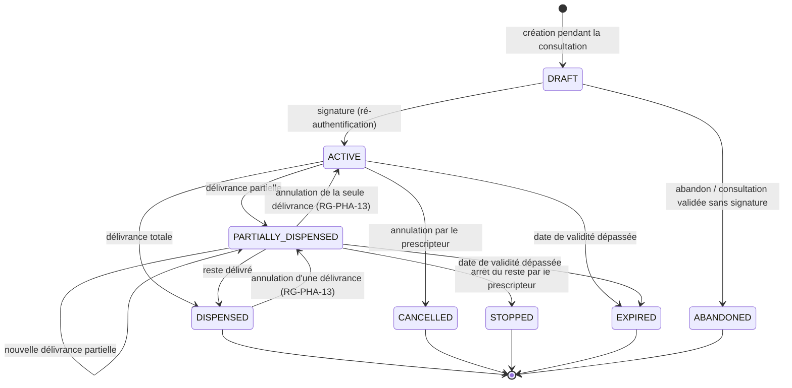

# 11. Fiches fonctionnelles — Prescription électronique et pharmacie

## 11.1 Cycle de vie d'une ordonnance

- **RG-PRE-00** — Une ordonnance `ACTIVE` ou postérieure est **immuable** : aucune ligne (médicament, posologie, quantité prescrite) ne peut être modifiée ; seuls évoluent le statut et les quantités délivrées, par les délivrances et leurs annulations. Pour changer un traitement, on annule (ou arrête) et on crée une nouvelle ordonnance.

### F-PRE-01 — Créer une ordonnance

| Élément | Valeur |
|---|---|
| Rôles | `DOCTOR` (auteur de la consultation en cours) |
| Priorité / étape | P0 / E17 |
| Écrans | Panneau « Ordonnance » dans l'écran de consultation |
| API | `POST /api/v1/consultations/{id}/prescriptions`, `PUT /api/v1/prescriptions/{id}/items` |

**Préconditions.** Une consultation du médecin est ouverte (`DRAFT`) pour ce patient (règle V1 : « une prescription doit être liée à une consultation et à un professionnel identifié »).

**Déroulé pas à pas.**

1. Le médecin touche « Prescrire ». Une ordonnance `DRAFT` est créée et liée à la consultation.
2. Pour chaque ligne, il cherche le médicament (F-PRE-03) puis renseigne la posologie **structurée** :

| Champ | Valeurs | Obligatoire |
|---|---|---|
| Médicament | Référentiel (DCI + forme + dosage) | Oui |
| Dose par prise | Nombre (ex. 1 ; 0,5 ; 5) | Oui |
| Unité de prise | comprimé, gélule, sachet, cuillère-mesure, ml, goutte, suppositoire, application, bouffée, injection, ovule | Oui |
| Voie | orale, sublinguale, intramusculaire, intraveineuse, sous-cutanée, cutanée, rectale, vaginale, oculaire, auriculaire, nasale, inhalée | Oui (pré-remplie selon la forme) |
| Fréquence | « X fois par jour » (1 à 6) **ou** « toutes les X heures » **ou** « si besoin » (avec maximum par 24 h) | Oui |
| Moments | matin, midi, soir, coucher (cases) | Non |
| Durée | Nombre de jours (1 à 90) **ou** « traitement de fond » | Oui |
| Quantité totale | **Calculée** = dose × prises par jour × jours (modifiable, arrondie à l'unité supérieure) | Oui |
| Instructions | Texte (200 caractères) + raccourcis : « avant le repas », « pendant le repas », « après le repas », « à jeun » | Non |
| Non substituable | Case ; si cochée, motif obligatoire | Non |

3. Le système affiche la ligne **en phrase lisible** : « Amoxicilline 500 mg gélule — 1 gélule 3 fois par jour pendant 7 jours, par voie orale, pendant le repas (21 gélules) ». C'est cette phrase qui apparaîtra au patient et au pharmacien.
4. Le médecin peut ajouter jusqu'à **10 lignes**, les réordonner, en supprimer (tant que `DRAFT`).
5. Les contrôles de sécurité (F-PRE-02) s'exécutent à chaque ajout de ligne.
6. Il signe (F-PRE-04).

**Règles strictes.**

- **RG-PRE-01** — Une ordonnance DOIT contenir de **1 à 10** lignes.
- **RG-PRE-02** — Pour un patient de moins de **12 ans**, le **poids** du jour (ou de moins de 30 jours) DOIT être renseigné avant la signature ; il est imprimé sur l'ordonnance.
- **RG-PRE-03** — Un médicament **hors référentiel** (texte libre) est autorisé en P1 uniquement, marqué « hors référentiel », et exclu des contrôles automatiques (le médecin en est averti).
- **RG-PRE-04** — Un `NURSE` NE PEUT PAS créer d'ordonnance de médicaments (RG-ROL-11).

### F-PRE-02 — Contrôles de sécurité de la prescription

| Élément | Valeur |
|---|---|
| Rôles | Système (affiché au `DOCTOR`) |
| Priorité / étape | P0 / E17 |
| API | `POST /api/v1/prescriptions/{id}/checks` |

| Contrôle | Déclencheur | Niveau | Ce que le médecin doit faire |
|---|---|---|---|
| **Allergie** | La DCI ou la **classe thérapeutique** du médicament correspond à une allergie du patient (déclarée ou confirmée) | **Bloquant** | Retirer la ligne **ou** forcer avec une justification (20 caractères minimum) ; le forçage est tracé et imprimé nulle part mais visible dans l'audit |
| **Doublon** | Même DCI déjà présente dans l'ordonnance ou dans une ordonnance active du patient | Avertissement | Confirmer ou retirer |
| **Même classe** | Deux médicaments de la même classe thérapeutique (ex. deux anti-inflammatoires non stéroïdiens) | Avertissement | Confirmer ou retirer |
| **Âge** | Médicament marqué « contre-indiqué avant X ans » dans le référentiel | Bloquant | Retirer ou forcer avec justification |
| **Grossesse** | Patiente avec grossesse en cours connue et médicament marqué « contre-indiqué pendant la grossesse » | Bloquant | Retirer ou forcer avec justification |
| **Durée** | Durée > 30 jours pour un antibiotique | Avertissement | Confirmer |

**Règles strictes.**

- **RG-PRE-10** — La correspondance allergie ↔ médicament DOIT se faire sur la **DCI** et sur la **classe** (ex. allergie « pénicilline » → toute molécule de la classe des pénicillines, dont l'amoxicilline) grâce à la table de correspondance du référentiel (section 18.4).
- **RG-PRE-11** — Les contrôles DOIVENT être **réexécutés côté serveur** au moment de la signature ; une signature avec un contrôle bloquant non justifié est refusée (`PRE_BLOCKING_ALERT`).
- **RG-PRE-12** — Les contrôles sont une **aide** : ils NE remplacent PAS le jugement du médecin ; le texte affiché le rappelle.

**Critère d'acceptation.** CA-1 : patient allergique à la pénicilline + amoxicilline → alerte bloquante ; la signature sans justification renvoie une erreur 422.

### F-PRE-03 — Référentiel des médicaments et recherche

| Élément | Valeur |
|---|---|
| Rôles | `DOCTOR` (recherche), `PLATFORM_ADMIN` (gestion, F-ADM-04) |
| Priorité / étape | P0 / E17 |
| API | `GET /api/v1/ref/medications?q=` |

**Contenu d'un médicament.** DCI (dénomination commune internationale), forme, dosage, code de classe thérapeutique (ATC), nom(s) commercial(aux) facultatif(s), indicateur « liste des médicaments essentiels », contre-indications codées (âge minimal, grossesse), statut (actif / retiré).

**Recherche.** À partir de **3 caractères**, insensible aux accents et à la casse, sur la DCI et les noms commerciaux ; résultats triés : médicaments essentiels d'abord, puis ordre alphabétique ; 20 résultats maximum.

**Règle stricte.** **RG-PRE-20** — Un médicament retiré du référentiel NE DOIT PLUS être proposé, mais les ordonnances existantes qui le contiennent restent lisibles. [Source du référentiel à confirmer avec l'autorité nationale du médicament ; le MVP utilise un sous-ensemble de départ fourni avec le projet.]

### F-PRE-04 — Signer l'ordonnance

| Élément | Valeur |
|---|---|
| Rôles | `DOCTOR` auteur |
| Priorité / étape | P0 / E17 |
| API | `POST /api/v1/prescriptions/{id}/sign` |

**Déroulé pas à pas.**

1. Le médecin touche « Signer l'ordonnance ».
2. Le système réexécute les contrôles (RG-PRE-11).
3. Il demande la **ré-authentification** (code du second facteur, RG-SEC-01) sauf si elle a eu lieu depuis moins de 5 minutes.
4. Dans une transaction, il :
   - attribue un **numéro d'ordonnance** unique au format `RX-XXXX-XXXX` (section 18.2) ;
   - calcule la **date de validité** : date de signature + durée de validité (paramètre, **3 mois** par défaut [DÉCISION à confirmer avec la réglementation pharmaceutique]) ;
   - construit le **contenu canonique** (JSON trié : patient, prescripteur, établissement, date, lignes) et calcule son **empreinte SHA-256** ;
   - génère un **jeton de vérification** aléatoire (stocké haché) ;
   - passe l'ordonnance à `ACTIVE`.
5. Il génère le **PDF** (à la demande, pas stocké) et le **QR code** contenant l'URL `https://[domaine]/v/o/RX-XXXX-XXXX?k=[jeton]`.
6. Il notifie le patient : « Une ordonnance a été ajoutée à votre dossier. »

**Contenu du PDF (ordre).** En-tête de l'établissement (nom, adresse, téléphone) ; prescripteur (nom, spécialité, numéro d'inscription) ; date ; patient (nom, prénoms, âge, sexe, poids si enfant) ; lignes en phrases lisibles ; mention « Non substituable » le cas échéant ; date de validité ; QR code ; numéro d'ordonnance et 8 premiers caractères de l'empreinte ; mention RG-CIT-51.

**Règles strictes.**

- **RG-PRE-30** — La signature DOIT être refusée si la ré-authentification échoue ; 3 échecs → déconnexion de la session (le verrouillage d'écran F-AUTH-08 le remplacera à l'étape E27).
- **RG-PRE-31** — Le PDF NE DOIT PAS contenir le diagnostic.
- **RG-PRE-32** — Il ne s'agit **pas** d'une signature électronique qualifiée au sens juridique ; le document le mentionne dans les conditions d'utilisation. (Signature qualifiée : P2.)

**Critères d'acceptation.** CA-1 : modifier une ligne après signature renvoie 409 `PRE_LOCKED`. CA-2 : l'empreinte recalculée sur les données en base correspond à l'empreinte enregistrée (test automatique d'intégrité).

### F-PRE-05 — Annuler, arrêter ou renouveler une ordonnance

| Élément | Valeur |
|---|---|
| Rôles | `DOCTOR` (auteur pour annuler/arrêter ; tout médecin avec base d'accès pour renouveler) |
| Priorité / étape | P1 / E17 |
| API | `POST /api/v1/prescriptions/{id}/cancel`, `/stop`, `/renew` |

- **Annuler** : possible seulement si **aucune délivrance** ; motif obligatoire ; patient notifié ; le QR affiche « Annulée ».
- **Arrêter** : après une délivrance partielle, arrête le reste ; motif obligatoire.
- **Renouveler** : crée une **nouvelle** ordonnance `DRAFT` pré-remplie avec les lignes de l'ancienne, dans une nouvelle consultation (ou une consultation « renouvellement » simplifiée : motif pré-rempli « Renouvellement d'ordonnance », diagnostic repris). Elle suit ensuite F-PRE-02 et F-PRE-04.

### F-PRE-06 — Vérifier une ordonnance (page publique du QR)

| Élément | Valeur |
|---|---|
| Rôles | Tout le monde (sans connexion) |
| Priorité / étape | P0 / E17 |
| Écrans | `/v/o/[numero]` |
| API | `GET /api/v1/public/prescriptions/{number}/verify?k=` |

**Affichage sans connexion (minimum d'informations).** « Ordonnance **authentique** n° RX-4K7M-2QX9, émise le 14/10/2026 par Dr A. Hounkpè (CS Akpakpa). Statut : **valable jusqu'au 14/01/2027** / délivrée / annulée / expirée. » Aucune donnée sur le patient, aucun médicament.

**Règles strictes.** **RG-PRE-40** — Sans jeton valide, la page affiche « Ordonnance introuvable » (le numéro seul ne suffit pas). **RG-PRE-41** — Limitation : 30 vérifications par minute et par adresse IP. **RG-PRE-42** — Si un pharmacien connecté ouvre ce lien, il est redirigé vers F-PHA-02.

### F-PHA-01 — Tableau de bord pharmacie

| Élément | Valeur |
|---|---|
| Rôles | `PHARMACIST` |
| Priorité / étape | P1 / E18 |
| Écrans | `/pharmacie` |

**Composition.** Grand bouton « Scanner une ordonnance » + champ « Numéro d'ordonnance » ; délivrances du jour (heure, numéro, nombre de lignes, statut) ; ordonnances partiellement délivrées par la pharmacie et encore valables (pour les patients qui reviennent).

### F-PHA-02 — Retrouver une ordonnance présentée

| Élément | Valeur |
|---|---|
| Rôles | `PHARMACIST` |
| Priorité / étape | P1 / E18 |
| API | `POST /api/v1/pharmacy/prescriptions/lookup` |

**Déroulé pas à pas.**

1. Le pharmacien **scanne le QR** (numéro + jeton) → accès direct.
2. **Ou** il saisit le numéro `RX-…` **et** l'**année de naissance** du patient (question posée au patient) → vérification.
3. Le système crée une base d'accès `ASSIGNMENT` (pharmacie ↔ ordonnance) valable **30 jours**, journalise `VIEW`.
4. Il affiche : statut et date de validité ; lignes avec quantité prescrite, **déjà délivrée** et **restante** ; patient (nom, prénoms, âge, sexe) ; **allergies médicamenteuses** ; prescripteur et établissement ; délivrances précédentes (pharmacie, date, quantités).

**Règles strictes.** **RG-PHA-01** — Numéro + année de naissance : **5 essais** par pharmacien et par heure, puis blocage 1 heure. **RG-PHA-02** — Le pharmacien NE VOIT JAMAIS le diagnostic, les autres ordonnances du patient, ni son dossier.

**Critère d'acceptation.** CA-1 : un numéro correct avec une mauvaise année de naissance renvoie « Ordonnance introuvable ».

### F-PHA-03 — Enregistrer une délivrance

| Élément | Valeur |
|---|---|
| Rôles | `PHARMACIST` |
| Priorité / étape | P1 / E18 |
| API | `POST /api/v1/prescriptions/{id}/dispensations` |

**Déroulé pas à pas.**

1. Pour chaque ligne, le pharmacien indique :
   - **quantité délivrée** (0 à quantité restante) ;
   - **produit délivré** : identique, ou **substitution** par un générique de **même DCI, même dosage, même forme** (choisi dans le référentiel) ;
   - si quantité 0 ou partielle : **raison** (rupture de stock, refus du patient, coût, autre) ;
   - numéro de lot et date de péremption (facultatifs en MVP).
2. Il confirme. Le système, dans une transaction **avec verrou sur l'ordonnance** : vérifie le statut et la validité, décrémente les quantités restantes, crée l'enregistrement de délivrance (pharmacie, pharmacien, date, lignes), met à jour le statut (`PARTIALLY_DISPENSED` ou `DISPENSED`).
3. Il notifie le patient (« Votre ordonnance du 14/10 a été délivrée [en partie] à la pharmacie X ») et, si une ligne n'a pas pu être délivrée pour rupture, l'indique.
4. Le pharmacien peut imprimer un ticket de délivrance (P2).

**Règles strictes.**

- **RG-PHA-10** — Une délivrance est **impossible** si l'ordonnance est `DRAFT`, `CANCELLED`, `STOPPED`, `EXPIRED` ou `DISPENSED` (message clair selon le cas).
- **RG-PHA-11** — La quantité délivrée cumulée NE DOIT JAMAIS dépasser la quantité prescrite, même si deux pharmacies délivrent au même moment (verrou `SELECT … FOR UPDATE` sur l'ordonnance).
- **RG-PHA-12** — Une ligne « non substituable » NE PEUT PAS être substituée.
- **RG-PHA-13** — Une délivrance est **immuable** ; une erreur de saisie peut être annulée **dans les 24 heures** par la même pharmacie avec un motif, ce qui restitue les quantités.

**Critères d'acceptation.** CA-1 : deux délivrances totales simultanées de la même ordonnance : une seule réussit (test automatisé). CA-2 : le patient voit « Délivrée en partie » avec la ligne manquante.

### F-PHA-04 — Historique des délivrances

| Élément | Valeur |
|---|---|
| Rôles | `PHARMACIST` |
| Priorité / étape | P1 / E18 |
| Écrans | `/pharmacie/historique` |

Liste des délivrances **de sa pharmacie** : date, numéro d'ordonnance, médicaments délivrés, pharmacien ; filtres par période et par médicament ; aucune donnée de patient au-delà du nom et de l'âge. Export CSV en P2.

### F-PHA-05 — Suivi simple des stocks (P2)

Décrémentation automatique d'un stock déclaré à chaque délivrance, seuil d'alerte par produit, indicateur agrégé « ruptures déclarées » pour le ministère. Non développé dans le MVP ; la raison « rupture de stock » saisie en F-PHA-03 alimente déjà un indicateur (chapitre 14).
