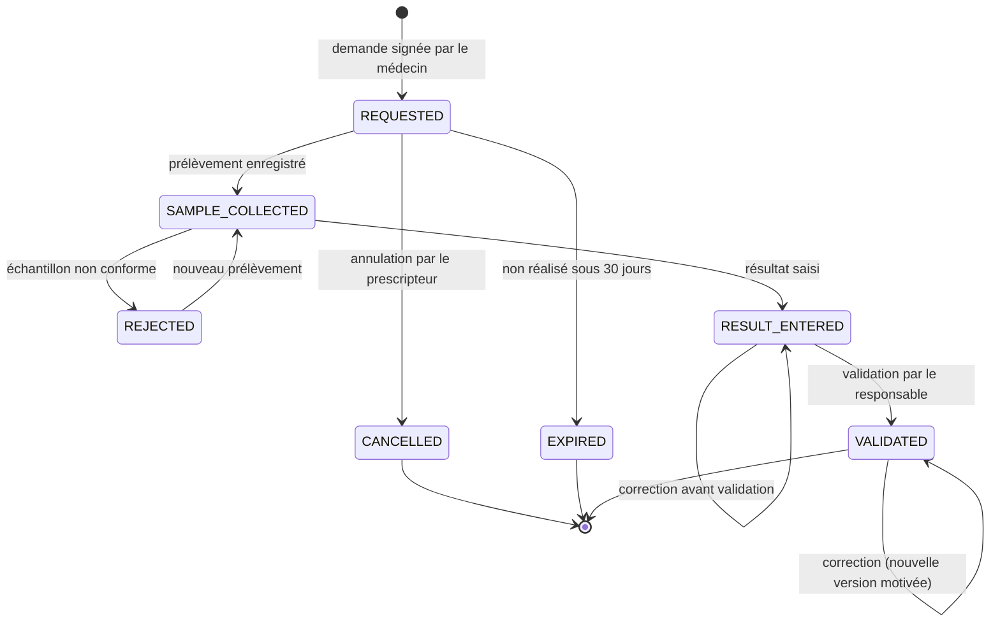

# 12. Fiches fonctionnelles — Examens et laboratoire

L'espace laboratoire utilise la couleur **turquoise** (section 19.2) et est organisé en **file de travail** : chaque demande avance d'une colonne à l'autre.

## 12.1 Cycle de vie d'une demande d'examen

### F-LAB-01 — Demander un examen

| Élément | Valeur |
|---|---|
| Rôles | `DOCTOR` |
| Priorité / étape | P1 / E19 |
| Écrans | Panneau « Examens » de la consultation |
| API | `POST /api/v1/consultations/{id}/lab-orders` |

**Déroulé pas à pas.**

1. Le médecin choisit un ou plusieurs examens dans le référentiel (section 18.4), regroupés par famille : hématologie (NFS), parasitologie (goutte épaisse, test de diagnostic rapide du paludisme), biochimie (glycémie, créatinine, transaminases), sérologie (VIH — **sensible**, hépatite B, syphilis), bactériologie (examen cytobactériologique des urines), imagerie (radiographie, échographie — compte rendu uniquement).
2. Il indique : urgence (`ROUTINE` ou `URGENT`), renseignements cliniques utiles au laboratoire (200 caractères, ex. « fièvre depuis 3 jours »), à jeun requis (automatique selon l'examen).
3. Il choisit le **laboratoire destinataire** : le laboratoire de son établissement, un laboratoire nommé, ou « **au choix du patient** » (n'importe quel laboratoire actif pourra la prendre en charge avec le code).
4. Il signe la demande (sans ré-authentification : ce n'est pas une prescription de médicament). Le système attribue un numéro `LB-XXXX-XXXX`, un jeton de QR et notifie le laboratoire destinataire.
5. Le patient voit la demande dans son espace (« Analyses demandées ») avec le QR à présenter.

**Règles strictes.**

- **RG-LAB-01** — Une demande DOIT être liée à une consultation et à un médecin (comme les ordonnances).
- **RG-LAB-02** — Un examen du groupe « sensible » (ex. sérologie VIH) DOIT être marqué `SENSITIVE` et `ANNOUNCE_REQUIRED` : le résultat ne sera montré au patient qu'après annonce par un professionnel (F-LAB-05).
- **RG-LAB-03** — Une demande non prise en charge sous **30 jours** passe à `EXPIRED`.

### F-LAB-02 — Recevoir la demande et enregistrer le prélèvement

| Élément | Valeur |
|---|---|
| Rôles | `LAB_TECH`, `LAB_SUPERVISOR` |
| Priorité / étape | P1 / E19 |
| Écrans | `/labo` (colonnes : À recevoir, Prélevé, Résultat saisi, À valider, Validé aujourd'hui) |
| API | `POST /api/v1/lab/orders/lookup`, `POST /api/v1/lab/orders/{id}/collect` |

**Déroulé.**

1. Demandes adressées au laboratoire : visibles dans « À recevoir ». Demandes « au choix du patient » : le technicien **scanne le QR** ou saisit le numéro **et** l'année de naissance du patient (comme F-PHA-02), ce qui les rattache à son laboratoire (base `ASSIGNMENT`).
2. Il vérifie l'identité du patient (nom, date de naissance) et coche « identité vérifiée ».
3. Il enregistre le **prélèvement** : date et heure, type d'échantillon (sang veineux, sang capillaire, urine, selles, autre), identifiant d'échantillon (étiquette imprimée, P2 : impression d'étiquettes), préleveur.
4. La demande passe à `SAMPLE_COLLECTED`.

**Rejet d'échantillon.** Motifs : hémolysé, quantité insuffisante, mauvais tube, délai dépassé, étiquetage incorrect. Le prescripteur et le patient sont notifiés (« Un nouveau prélèvement est nécessaire »).

**Règle stricte.** **RG-LAB-10** — Une demande rattachée à un laboratoire NE PEUT PLUS être prise en charge par un autre, sauf libération explicite par le premier (motif).

### F-LAB-03 — Saisir un résultat

| Élément | Valeur |
|---|---|
| Rôles | `LAB_TECH`, `LAB_SUPERVISOR` |
| Priorité / étape | P1 / E19 |
| API | `PUT /api/v1/lab/orders/{id}/results` |

**Déroulé.** Pour chaque paramètre de l'examen (défini dans le référentiel : ex. NFS = hémoglobine, globules blancs, plaquettes…), le technicien saisit la valeur ; l'unité et les **valeurs de référence** (selon sexe et âge) sont affichées automatiquement ; le système calcule l'**indicateur** (`N` normal, `L` bas, `H` haut, `LL`/`HH` critique). Résultats qualitatifs : liste (positif/négatif, présence/absence + densité parasitaire). Commentaire facultatif. Pièce jointe PDF facultative (compte rendu). Enregistrement → `RESULT_ENTERED`.

**Règles strictes.** **RG-LAB-20** — Une valeur numérique hors des **limites physiologiquement possibles** du paramètre est refusée. **RG-LAB-21** — Une valeur **critique** (`LL`/`HH`) DOIT déclencher, à la validation, une notification **prioritaire** au prescripteur (et au responsable d'établissement du prescripteur si non lue sous 2 h).

### F-LAB-04 — Valider un résultat

| Élément | Valeur |
|---|---|
| Rôles | `LAB_SUPERVISOR` |
| Priorité / étape | P1 / E19 |
| Écrans | `/labo/validation` |
| API | `POST /api/v1/lab/orders/{id}/validate` |

**Déroulé.** Le responsable voit la liste des résultats saisis ; il ouvre un résultat (valeurs, indicateurs, antériorités du patient pour cet examen s'il y en a dans le même laboratoire), puis « Valider » (ré-authentification si la dernière date de plus de 5 minutes) ou « Renvoyer pour correction » (commentaire). Validation → `VALIDATED`, horodatage, empreinte du contenu, notifications (F-LAB-05).

**Règles strictes.** RG-ROL-30 (quatre yeux) et RG-ROL-31 (correction par nouvelle version). **RG-LAB-30** — Seuls les résultats `VALIDATED` sont visibles en dehors du laboratoire.

**Critère d'acceptation.** CA-1 : un technicien qui tente de valider son propre résultat reçoit 403 `LAB_SELF_VALIDATION`.

### F-LAB-05 — Mise à disposition et annonce des résultats

| Élément | Valeur |
|---|---|
| Rôles | Système ; `DOCTOR` (annonce) |
| Priorité / étape | P1 / E19 |
| API | `POST /api/v1/lab/orders/{id}/release` |

**Règles strictes.**

- **RG-LAB-40** — Résultat standard validé : visible immédiatement par le **prescripteur** (notification « Résultat disponible pour [patient] ») et par le **patient** (notification sans valeur : « Un résultat d'analyse est disponible dans votre dossier »).
- **RG-LAB-41** — Résultat `ANNOUNCE_REQUIRED` : visible par le prescripteur uniquement ; le patient voit « Un résultat vous sera communiqué par votre médecin ». Le médecin, après avoir reçu le patient, touche « Résultat annoncé au patient » : le résultat devient visible pour le patient. Sans annonce sous **30 jours**, l'auditeur est alerté (pas de libération automatique).
- **RG-LAB-42** — Aucune notification (SMS ou application) NE DOIT contenir le nom de l'examen ni la valeur.

### F-LAB-06 — Annuler une demande

Le prescripteur peut annuler une demande `REQUESTED` (motif) ; le patient et le laboratoire rattaché sont notifiés. Un laboratoire peut **libérer** une demande « au choix du patient » qu'il a prise par erreur (motif) avant prélèvement.
