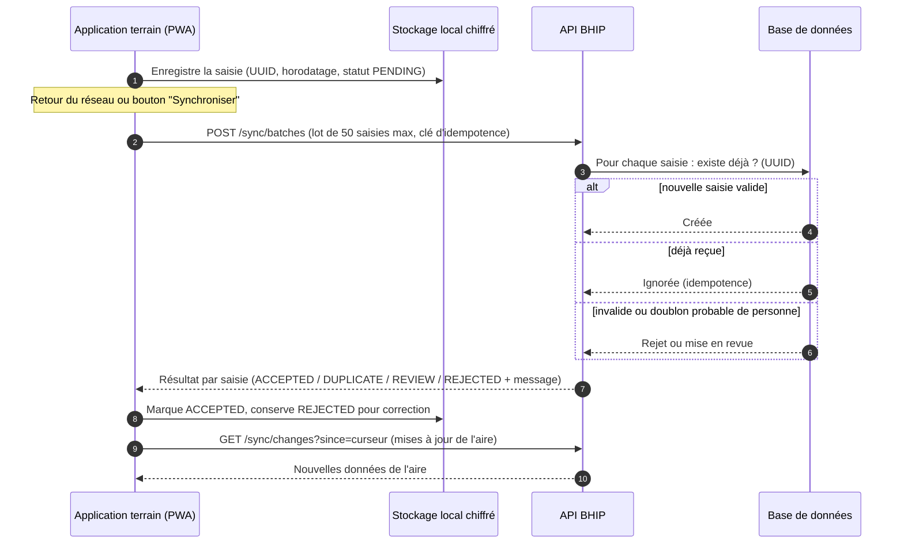

# 13. Fiches fonctionnelles — Santé communautaire et mode hors ligne

## 13.1 Périmètre exact du hors ligne

La V1 demande un fonctionnement avec connectivité limitée « partout ». Pour rester réalisable et sûr, le périmètre est **fixé** ainsi :

| Espace | Hors ligne en **lecture** | Hors ligne en **saisie** |
|---|---|---|
| Citoyen | Tableau de bord, carte santé (QR de secours), dernières ordonnances déjà consultées | Non |
| Professionnel (`DOCTOR`, `NURSE`) | Non (données trop sensibles pour un poste partagé) | **Brouillon de consultation uniquement** (RG-CLI-42), renvoyé au retour du réseau |
| Agent communautaire (`CHW`) | Personnes de son aire, carnets de vaccination, visites précédentes | **Oui** : nouvelles personnes, visites, vaccinations |
| Autres | Non | Non |

- **RG-OFF-01** — Toute donnée stockée sur l'appareil DOIT être **chiffrée** (AES-GCM via l'API Web Crypto) avec une clé dérivée du code PIN (PBKDF2, 310 000 itérations) ; la clé n'est jamais stockée.
- **RG-OFF-02** — Les saisies hors ligne DOIVENT être des **créations** portant un **identifiant généré sur l'appareil** (UUID v7) et un **horodatage local** ; le serveur les accepte de façon **idempotente** (renvoyer deux fois la même saisie ne crée pas de doublon).
- **RG-OFF-03** — Il n'y a **pas de modification hors ligne** de données existantes : aucun conflit de fusion n'est donc possible (RG-ROL-22).
- **RG-OFF-04** — L'application DOIT afficher en permanence l'état : « En ligne », « Hors ligne — X saisies en attente », « Synchronisation… ».

### F-COM-01 — Préparer l'appareil

| Élément | Valeur |
|---|---|
| Rôles | `CHW` |
| Priorité / étape | P1 / E22 |
| Écrans | `/terrain/preparation` |
| API | `GET /api/v1/community/area/snapshot` |

**Déroulé pas à pas.**

1. Avec du réseau, l'agent se connecte (mot de passe + second facteur).
2. L'application propose l'**installation** sur l'écran d'accueil du téléphone (PWA) avec une explication illustrée.
3. L'agent définit un **code PIN** de 6 chiffres (deux fois), différent de 000000, 123456 et des dates évidentes.
4. L'application télécharge l'**instantané de son aire** : personnes de ses villages/quartiers (identité, carnet de vaccination, dernières visites communautaires), référentiels (vaccins, questionnaires, signes de danger), et affiche la taille téléchargée.
5. L'écran « Prêt pour le terrain » indique la date de l'instantané.

**Règles strictes.** **RG-COM-01** — L'instantané est limité à l'aire affectée (RG-ROL-20) et à **5 000 personnes** au maximum. **RG-COM-02** — 5 PIN erronés effacent les données locales non synchronisables et exigent une reconnexion en ligne ; les saisies non synchronisées sont conservées chiffrées pour être envoyées après reconnexion. **RG-COM-03** — Après **30 jours** sans synchronisation, les données de lecture sont effacées (les saisies en attente sont conservées).

### F-COM-02 — Enregistrer une personne

| Élément | Valeur |
|---|---|
| Rôles | `CHW` |
| Priorité / étape | P1 / E22 |
| Écrans | `/terrain/personnes/nouvelle` |

Formulaire identique à F-CLI-03 (y compris date approximative), avec en plus : village/quartier (liste de l'aire), ménage (chef de ménage, facultatif). **Hors ligne**, la recherche de doublons se fait **sur les données locales** ; au moment de la synchronisation, le serveur refait le contrôle sur toute la base : un doublon probable (score ≥ 80) est mis **en revue** (statut `REVIEW`) au lieu d'être créé, et l'agent voit « À vérifier : cette personne existe peut-être déjà ».

### F-COM-03 — Visite à domicile

| Élément | Valeur |
|---|---|
| Rôles | `CHW` |
| Priorité / étape | P1 / E22 |
| Écrans | `/terrain/visite/nouvelle` |

**Déroulé.** L'agent choisit la personne, le **type de visite** (suivi général, enfant de moins de 5 ans, femme enceinte, suivi après sortie, sensibilisation), puis répond à un **questionnaire guidé** (questions fermées, grandes cases). Le questionnaire contient une liste de **signes de danger** (ex. enfant : incapable de boire ou téter, vomit tout, convulsions, léthargie ; femme enceinte : saignement, maux de tête sévères avec vision trouble, convulsions, fièvre élevée). Si un signe de danger est coché, l'application affiche en rouge « **Référer immédiatement au centre de santé** » et crée une **référence communautaire** (motif, urgence) que le centre de santé verra à la synchronisation.

**Règles strictes.** **RG-COM-10** — Les questionnaires et la liste des signes de danger DOIVENT être des **données de référentiel** (versionnées), pas du code, pour être validés par les autorités sanitaires. [Contenu clinique exact à valider par le programme national de santé communautaire.] **RG-COM-11** — L'application NE DOIT PAS proposer de diagnostic ni de traitement.

### F-COM-04 — Vaccination de terrain

Même données que F-CLI-11, avec « lieu : campagne / stratégie avancée » et le nom de la campagne. Le carnet de vaccination local est mis à jour immédiatement ; les contrôles (âge, intervalle, doublon) fonctionnent hors ligne sur les données locales.

### F-COM-05 à F-COM-07 — Suivi de grossesse, suivi de l'enfant, campagnes (P2)

- **F-COM-05** : fiche de grossesse (date des dernières règles, terme prévu calculé, consultations prénatales réalisées, signes de danger), rappels de consultation prénatale.
- **F-COM-06** : courbe de poids de l'enfant de moins de 5 ans, périmètre brachial (dépistage de la malnutrition), rappels du calendrier vaccinal.
- **F-COM-07** : définition d'une campagne (antigène, cible d'âge, aire, dates), suivi de la couverture en temps réel en agrégé.

Le modèle de données (chapitre 21) réserve la table `pregnancies` (utilisée dès le MVP par les soignants) et mentionne les tables futures (`child_growth`, suivi de grossesse communautaire, `campaigns`) ; aucun écran dans le MVP.

### F-COM-08 — Synchroniser

| Élément | Valeur |
|---|---|
| Rôles | `CHW` |
| Priorité / étape | P1 / E22 |
| Écrans | `/terrain/synchronisation` |
| API | `POST /api/v1/sync/batches`, `GET /api/v1/sync/changes?since=` |

**Déroulé.** Automatique au retour du réseau (événement `online`) et manuel (bouton). Envoi par lots de **50** saisies, dans l'ordre chronologique ; affichage de la progression ; résultat par saisie : **Acceptée**, **Déjà reçue**, **À vérifier**, **Refusée** (avec la raison et un bouton « Corriger »). Puis récupération des changements de l'aire.

**Règles strictes.** **RG-COM-20** — Une saisie n'est retirée du stockage local qu'après confirmation `ACCEPTED` ou `DUPLICATE` du serveur. **RG-COM-21** — Le serveur DOIT enregistrer l'horodatage local **et** l'horodatage de réception ; un écart de plus de **72 heures dans le futur** par rapport au serveur est refusé (horloge de l'appareil déréglée). **RG-COM-22** — Chaque lot est journalisé dans l'audit (`SYNC_BATCH`) avec le nombre de saisies par statut.

**Critères d'acceptation.** CA-1 : en mode avion, 3 visites saisies ; au retour du réseau, les 3 sont acceptées et visibles au centre de santé. CA-2 : couper le réseau au milieu d'un envoi puis renvoyer ne crée aucun doublon.
