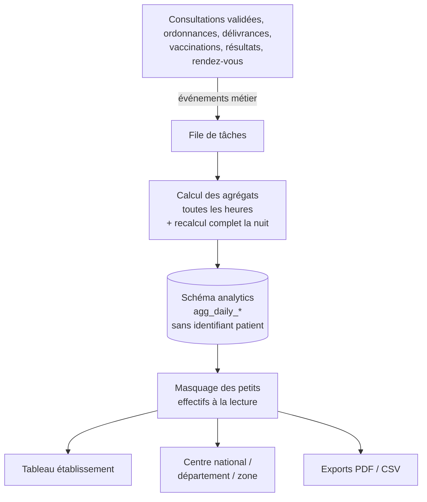

# 14. Fiches fonctionnelles — Pilotage, indicateurs et tableaux de bord

## 14.1 Principe : le pilotage ne lit que des agrégats

Les tableaux de bord (établissement et autorités sanitaires) NE LISENT JAMAIS les tables de données individuelles. Un **processus de calcul** (F-PIL-07) produit des **tables agrégées** dans un schéma de base de données séparé, `analytics`. Les rôles de pilotage n'ont accès qu'à ce schéma.

**Règles strictes.**

- **RG-PIL-01** — Les tables `analytics` NE DOIVENT contenir **aucun identifiant de patient**, aucun nom, aucune date de naissance exacte : seulement des dimensions agrégées (date, établissement, territoire, sexe, tranche d'âge, code d'indicateur, code de groupe de maladies) et des comptes.
- **RG-PIL-02** — Masquage des petits effectifs : toute valeur de **1 à 4** DOIT être affichée « < 5 » et exportée « < 5 » ; les taux calculés sur un dénominateur inférieur à **20** sont affichés « effectif insuffisant ». Le zéro est affiché 0.
- **RG-PIL-03** — **Masquage complémentaire** : dans un tableau avec total, si une seule cellule d'une ligne est masquée, une deuxième cellule (la plus petite) DOIT aussi être masquée pour empêcher de retrouver la valeur par soustraction.
- **RG-PIL-04** — Le rôle de base de données utilisé par les requêtes de pilotage (`analytics_reader`) DOIT n'avoir de droits **que** sur le schéma `analytics` (vérifié par un test).
- **RG-PIL-05** — Les données `SENSITIVE` ne sont comptées qu'au niveau **département ou national**, jamais par établissement ni par commune.

## 14.2 Catalogue des indicateurs du MVP

| Code | Indicateur | Définition exacte | Dimensions | Priorité |
|---|---|---|---|---|
| `IND-01` | Consultations | Nombre de consultations `VALIDATED` (hors « saisies par erreur ») par date de démarrage | Territoire, établissement, type d'établissement, sexe, tranche d'âge, jour/semaine/mois | P0 |
| `IND-02` | Patients vus | Nombre de patients distincts ayant au moins une consultation validée sur la période | Idem | P0 |
| `IND-03` | Top des diagnostics | Consultations par **groupe de maladies** (section 18.6) du diagnostic principal | Territoire, sexe, tranche d'âge, période | P0 |
| `IND-04` | Cas de paludisme | Consultations avec diagnostic principal B50–B54 ; dont confirmés par test (goutte épaisse ou TDR positif lié) | Territoire, tranche d'âge (< 5 ans / ≥ 5 ans), semaine | P0 |
| `IND-05` | Établissements actifs | Établissements avec au moins 1 consultation validée dans les 7 derniers jours / total des établissements actifs dans le référentiel | Territoire, type | P0 |
| `IND-06` | Professionnels actifs | Professionnels ayant validé au moins 1 acte dans les 30 derniers jours | Territoire, profession | P0 |
| `IND-07` | Rendez-vous | Rendez-vous pris, honorés, annulés, absences ; **taux d'absence** = absences / (honorés + absences) | Établissement, service, période | P0 |
| `IND-08` | Ordonnances | Ordonnances signées ; **taux de délivrance** = ordonnances délivrées totalement ou partiellement / ordonnances signées (délai 30 j) | Territoire, période | P1 |
| `IND-09` | Ruptures déclarées | Lignes non délivrées avec raison « rupture de stock », par médicament (DCI) | Territoire, médicament, semaine | P1 |
| `IND-10` | Vaccinations | Doses administrées par vaccin et numéro de dose | Territoire, tranche d'âge, lieu (établissement / terrain), mois | P1 |
| `IND-11` | Délai d'attente | Médiane (arrivée → démarrage de consultation), en minutes | Établissement, service | P1 |
| `IND-12` | Qualité de saisie | Part des consultations validées tardivement (> 48 h) ; part des arrivées vérifiées « sur pièce » | Établissement | P1 |
| `IND-13` | Adoption | Comptes citoyens créés, comptes actifs sur 30 jours | Territoire (commune de résidence déclarée) | P0 |

**Tranches d'âge standard** : 0–11 mois, 1–4 ans, 5–14 ans, 15–24 ans, 25–49 ans, 50–64 ans, 65 ans et plus. **Territoires** : national → département (12) → zone sanitaire (34) → commune → établissement.

- **RG-PIL-10** — Chaque indicateur DOIT avoir sa définition affichée dans l'interface (icône « i ») et documentée dans le code, identique à ce tableau.
- **RG-PIL-11** — L'âge utilisé est l'âge **à la date de l'événement**.

### F-PIL-01 — Tableau de bord d'établissement

| Élément | Valeur |
|---|---|
| Rôles | `FACILITY_ADMIN` |
| Priorité / étape | P0 / E24 |
| Écrans | `/etablissement` |
| API | `GET /api/v1/analytics/facility?period=` |

**Composition.** Sélecteur de période (aujourd'hui, 7 jours, 30 jours, mois, personnalisée). Rangée d'indicateurs clés : consultations (`IND-01`), patients vus, rendez-vous du jour et taux d'absence (`IND-07`), délai d'attente médian (`IND-11`). Graphique d'évolution des consultations par jour. Top 10 des diagnostics (groupes). Activité par service et par professionnel (**nombre d'actes seulement**). Personnel actif / invité / suspendu. Accès d'urgence réalisés dans l'établissement (date, professionnel, statut de revue — sans patient ni contenu).

### F-PIL-02 — Centre national de pilotage

| Élément | Valeur |
|---|---|
| Rôles | `HEALTH_AUTHORITY` (portée nationale, départementale ou de zone) |
| Priorité / étape | P0 / E24 |
| Écrans | `/pilotage` |
| API | `GET /api/v1/analytics/overview?scope=&period=&territory=` |

**Composition (ordre imposé).**

1. **Barre de filtres** (toujours visible) : territoire (limité à la portée de l'utilisateur), période, type d'établissement, sexe, tranche d'âge. Les filtres sont reflétés dans l'URL pour pouvoir partager une vue.
2. **Indicateurs clés** (6 cartes) : consultations, patients vus, établissements actifs, cas de paludisme, taux de délivrance, vaccinations — avec la **variation** par rapport à la période précédente (flèche + pourcentage). Les cartes d'indicateurs P1 (taux de délivrance, vaccinations) affichent « Module non activé » si le module correspondant n'est pas livré.
3. **Carte** (F-PIL-03) à gauche, **top des diagnostics** à droite.
4. **Évolution** hebdomadaire des consultations et des cas de paludisme (12 dernières semaines).
5. **Alertes** (F-PIL-06).
6. Mention permanente en pied de page : « Données agrégées et anonymisées — valeurs inférieures à 5 masquées — mise à jour : [date heure] ».

**Règles strictes.** **RG-PIL-20** — Un utilisateur de portée `DEPARTMENT` NE PEUT PAS voir un autre département, ni le détail des autres départements dans les comparaisons (seulement la moyenne nationale). **RG-PIL-21** — Chaque ouverture et chaque changement de filtre sont journalisés (`ANALYTICS_VIEW`).

**Critère d'acceptation.** CA-1 : aucune réponse des API `/analytics/*` ne contient de champ identifiant un patient (test automatisé sur le schéma des réponses).

### F-PIL-03 — Carte sanitaire interactive

| Élément | Valeur |
|---|---|
| Rôles | `HEALTH_AUTHORITY` ; version publique simplifiée (établissements seulement) pour tous via F-ETA-01 |
| Priorité / étape | P0 / E24 |

**Fonctionnement.** Carte des **12 départements** (puis des communes au zoom) colorée selon l'indicateur choisi (**carte choroplèthe**, 5 classes, légende visible, palette séquentielle accessible) ; couche « établissements » (points par type) activable. Survol / toucher d'un territoire : nom et valeur (ou « < 5 »). Clic : filtre tout le tableau de bord sur ce territoire. Les contours viennent de fichiers GeoJSON publics (section 22.6), simplifiés pour peser moins de 500 Ko.

**Règle stricte.** **RG-PIL-30** — Pour un indicateur `SENSITIVE`, la carte NE DOIT PAS descendre sous le niveau département.

### F-PIL-04 — Tendances et comparaisons

| Élément | Valeur |
|---|---|
| Rôles | `HEALTH_AUTHORITY` |
| Priorité / étape | P1 / E24 |
| Écrans | `/pilotage/tendances` |

Choix d'un indicateur, d'une granularité (semaine, mois), d'une période (jusqu'à 24 mois) et de **2 à 5 territoires** à comparer (dans la portée) ; graphique en courbes avec valeurs au survol, tableau de données sous le graphique (accessibilité), bouton « Télécharger les données ».

### F-PIL-05 — Exports et rapports

| Élément | Valeur |
|---|---|
| Rôles | `HEALTH_AUTHORITY`, `FACILITY_ADMIN` (son établissement) |
| Priorité / étape | P1 / E24 |
| API | `POST /api/v1/analytics/exports` |

Formats : **PDF** (rapport mis en page : filtres, indicateurs clés, graphiques, tableau, définitions, mention de masquage) et **CSV** (données du tableau). **RG-PIL-40** — Un export exige un **motif** (liste : rapport mensuel, réunion, planification, autre + texte) et la ré-authentification ; il est journalisé `EXPORT` avec les filtres. **RG-PIL-41** — Les règles de masquage s'appliquent **avant** l'export.

### F-PIL-06 — Alertes épidémiologiques simples

| Élément | Valeur |
|---|---|
| Rôles | `HEALTH_AUTHORITY` |
| Priorité / étape | P1 / E24 |

**Règle de détection (MVP).** Pour chaque zone sanitaire et chaque groupe de maladies surveillé (paludisme, diarrhées, rougeole, méningite, fièvres hémorragiques suspectes), une alerte est levée si le nombre de cas de la semaine écoulée est supérieur à **la moyenne des 8 semaines précédentes + 2 écarts-types**, avec un minimum de **10 cas**. Pour les maladies à déclaration immédiate (liste paramétrable), **1 cas** suffit. **RG-PIL-50** — Une alerte est un **signal statistique à vérifier**, présenté comme tel ; elle ne déclenche aucune communication automatique vers le public. Statuts : `NEW`, `ACKNOWLEDGED` (vue, commentaire), `CLOSED` (motif), enregistrés dans la table `health_alert_reviews` (le schéma `analytics` reste en lecture seule).

### F-PIL-07 — Calcul des agrégats (processus technique)

| Élément | Valeur |
|---|---|
| Rôles | Système |
| Priorité / étape | P0 / E24 |

**Fonctionnement.**

1. Chaque événement métier pertinent (consultation validée ou retirée, ordonnance signée, délivrance, vaccination, rendez-vous changeant d'état, compte créé) publie un **événement** dans une file de tâches.
2. Une tâche **horaire** recalcule les agrégats des jours touchés par les événements reçus (recalcul **par jour et par établissement**, pas incrémental, pour rester exact en cas de correction).
3. Une tâche **nocturne** (02 h 00) recalcule les 90 derniers jours complets (filet de sécurité).
4. Les agrégats portent la date et l'heure de calcul, affichées dans les tableaux de bord.

**Règles strictes.** **RG-PIL-60** — Le recalcul d'un jour DOIT être **idempotent** (supprimer puis réinsérer les lignes du jour et de l'établissement dans une transaction). **RG-PIL-61** — Les consultations retirées « saisies par erreur » DOIVENT disparaître des agrégats au recalcul suivant.
